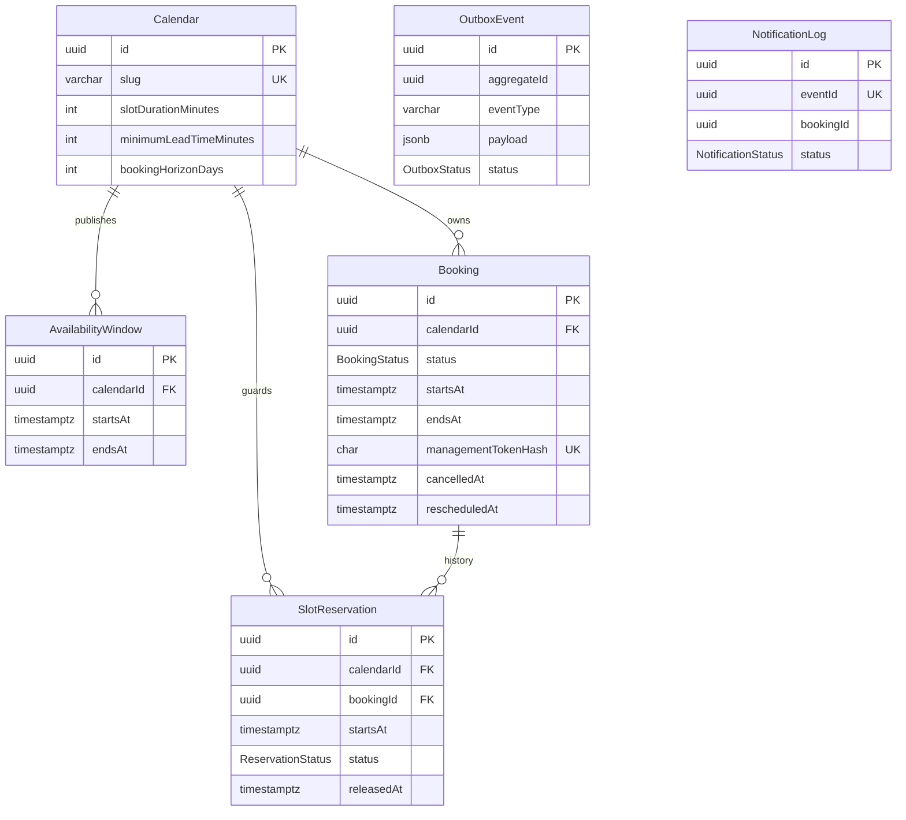

# Модель данных backend

Источник исполняемой истины — [`backend/prisma/schema.prisma`](../backend/prisma/schema.prisma)
и SQL-миграции. Все временные поля имеют тип `timestamptz(0)` и сравниваются как UTC;
интервалы трактуются как полуинтервалы `[startsAt, endsAt)`.

## Инварианты и индексы

- `availability_no_overlap` — PostgreSQL GiST exclusion constraint по
  `(calendar_id, tstzrange(starts_at, ends_at, '[)'))`. Prisma не умеет выразить
  exclusion constraint, поэтому он добавлен безопасной SQL-миграцией; смежные окна разрешены.
- `reservation_one_active_slot` — partial unique index `(calendar_id, starts_at) WHERE
  status = 'ACTIVE'`. Это будущая защита от гонки бронирования: отмененная запись остается
  в истории, а слот можно занять снова. Второй partial index запрещает две активные
  резервации одного Booking.
- CHECK constraints фиксируют 30-минутную UTC-сетку, длительность Booking ровно 30 минут,
  максимум 14 дней для AvailabilityWindow и согласованность статусов с `cancelledAt` /
  `releasedAt`. Выражения явно используют `AT TIME ZONE 'UTC'`, а не timezone сессии БД.
- `booking_owner_list_idx`, `availability_calendar_range_idx` и
  `reservation_slot_query_idx` покрывают owner/read и slot queries. Integration-тест
  проверяет допустимый index plan с отключенным sequential scan.
- Booking не удаляется при отмене или переносе: статус и временные метки сохраняют историю;
  резервации переходят из `ACTIVE` в `RELEASED`.
- `OutboxEvent` и `NotificationLog` подготовлены для этапа 7, но publisher/consumer и
  RabbitMQ на этом этапе намеренно отсутствуют.

## Persistence boundary

Контроллеры возвращают только contract DTO. Prisma изолирован в небольших repository-классах
модулей calendars, availability, slots и owner; доменные правила и преобразования находятся
в services. Генератор слотов — чистый сервис без базы и системных часов. Текущее время
предоставляется через injectable `Clock`, что делает тесты детерминированными.
